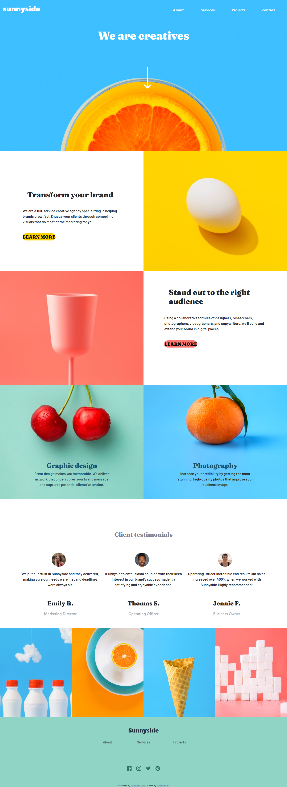

# Frontend Mentor - Sunnyside agency landing page

This is a solution to the [Sunnyside agency landing page challenge on Frontend Mentor](https://www.frontendmentor.io/challenges/sunnyside-agency-landing-page-7yVs3B6ef). Frontend Mentor challenges help you improve your coding skills by building realistic projects.

## Table of contents

- [The challenge](#the-challenge)
- [Screenshot](#screenshot)
- [Links](#links)
- [My process](#my-process)
  - [Built with](#built-with)
- [Author](#author)
-

### Screenshot

### Links

- Solution URL: [ solution ](https://www.frontendmentor.io/solutions/bootstrap-mobile-first-workflow-CsPfSbR_dN)
- Live Site URL: [ live site ]( https://mikosis123.github.io/mikosis123-Sunnyside-agency-landing-page-challenge-on-Frontend-Mentor/)

## My process

this project is built with mobile first priciple using html and advanced css

### Built with

- Semantic HTML5 markup
- CSS custom properties
- Flexbox
- CSS Grid
- Mobile-first workflow
  -Bootstrap

## Author

- Website - [Mikiyas sisay](https://portfolio-1-185e1.web.app/)
- Frontend Mentor - [@mikosis123](https://www.frontendmentor.io/profile/mikosis123)
- linkdin- [Mikiyas sisay](https://www.linkedin.com/in/mikiyas-sisay/)
